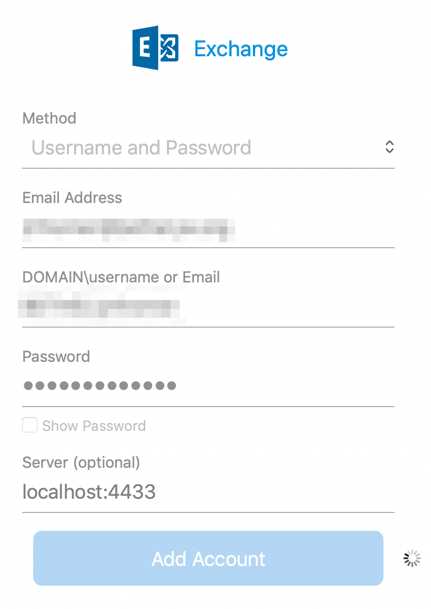
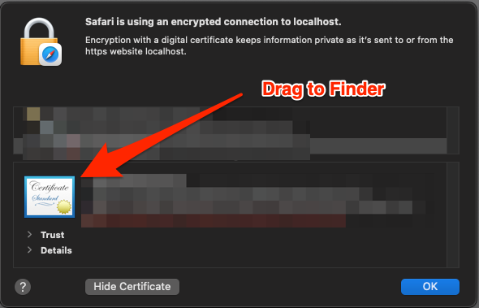
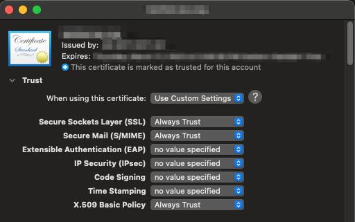

# Accessing Exchange With Outlook Via Port Forwarding


## Configuring Outlook

You will first need to forward some ports from your local machine to the machine that has
access to the Exchange server. For example, in your SSH config, you might put something
like this, substituting the names of the appropriate servers for your Exchange server and
directory server:

```
Host work
   HostName your-machine-name.yourenterprise.org
   User your-username
   LocalForward 4433 your-internal-mail-server.yourenterprise.org:443
   LocalForward 3269 your-internal-mail-server.yourenterprise.org:3269
```

Then, once you've established a connection to your work machine, you should be able to
configure Outlook like this:



After the account is added, go to the advanced account settings and make sure it looks
like this (primarily, checking the box to use SSL for the directory service).


You will likely need to accept some certificate warnings since "localhost" won't be a
valid name on the cert. Of course, as with any cert warnings, you should do your due
diligence and make sure the cert you're (hopefully not blindly) accepting is legitimate.


### Newer Outlook Setup (if above fails)

When I set up my M1 in 2021, the procedure above wouldn't work. Unfortunately, I didn't
document the entire process at the time, so I don't remember all the exact details. Here's
what I remember:

IIRC, there were two main problems:

   1. I could not get to the "advanced configuration" screen in the newer version of
      Outlook, because that screen was only accessible after you've setup the account
      using auto-discovery. Since auto-discovery doesn't work in this port-forwarding
      configuration, you couldn't ever tell it to use localhost.
   2. It kept silently failing, even after I used the script below to setup the account.
      This problem was caused by the certificate not being trusted since the domain on the
      cert does not include "localhost". This part I struggled with for a couple days
      until I finally figured out how to get around it. In older versions of Outlook,
      you'd get a popup that told you there was a cert error (the cert isn't signed for
      "localhost" domain), and then you could just accept the error and move on. But the
      newer version of Outlook doesn't seem to show that error, so you don't really know
      what's failing. I figured out it was the cert, even though the error wasn't
      appearing.

The solutions to those problems were:

   1. **Account setup when auto-discovery fails:** Use the AppleScript in
      `../scripts/setup-outlook.scpt` to setup the account, bypassing the whole
      auto-discovery thing. Open the script (which will open in the native Script Editor
      app), update the variables at the top of the script, and then run the script from
      the script editor. Then re-open Outlook and your account should appear there.
   2. **Cert error:** Visit <https://localhost:4433/EWS/Exchange.asmx> in Safari (must be
      Safari). View the certificate. Drag the certificate icon to Finder (e.g. your
      Desktop or Downloads folder). Double-click the cert file from Finder to open it in
      Keychain. Then change the trust settings in the Keychain to "Always Trust" for SSL
      and X.509 Basic Policy. (The screenshot shows it also being trusted for MIME, but
      that's not actually necessary)





## Avoiding Auto Reconfiguration

Sometimes your Exchange server will automatically tell your Outlook to update its server
settings, replacing "localhost" with the real server name. You can disable that using a
little AppleScript magic.

Open the app "Script Editor" in order to run an AppleScript. Then paste this script in,
and hit the "run" button to run it:

```
tell application "Microsoft Outlook"
   set background autodiscover of exchange account 1 to false
end tell
```
