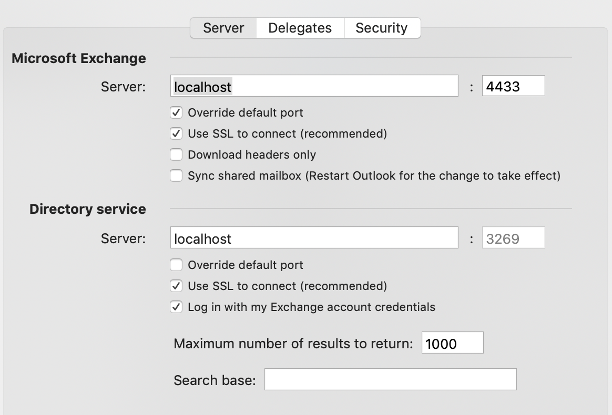

# Accessing Exchange With Outlook Via Port Forwarding


## Configuring Outlook

You will first need to forward some ports from your local machine to the machine that has
access to the Exchange server. For example, in your SSH config, you might put something
like this, substituting the names of the appropriate servers for your Exchange server and
directory server:

```
Host work
   HostName your-machine-name.yourenterprise.org
   User your-username
   LocalForward 4433 your-internal-mail-server.yourenterprise.org:443
   LocalForward 3269 your-internal-mail-server.yourenterprise.org:3269
```

Then, once you've established a connection to your work machine, you should be able to
configure Outlook like this:


After the account is added, go to the advanced account settings and make sure it looks
like this (primarily, checking the box to use SSL for the directory service).



You will likely need to accept some certificate warnings since "localhost" won't be a
valid name on the cert. Of course, as with any cert warnings, you should do your due
diligence and make sure the cert you're (hopefully not blindly) accepting is legitimate.


## Avoiding Auto Reconfiguration

Sometimes your Exchange server will automatically tell your Outlook to update its server
settings, replacing "localhost" with the real server name. You can disable that using a
little AppleScript magic.

Open the app "Script Editor" in order to run an AppleScript. Then paste this script in,
and hit the "run" button to run it:

```
tell application "Microsoft Outlook"
   set background autodiscover of exchange account 1 to false
end tell
```
